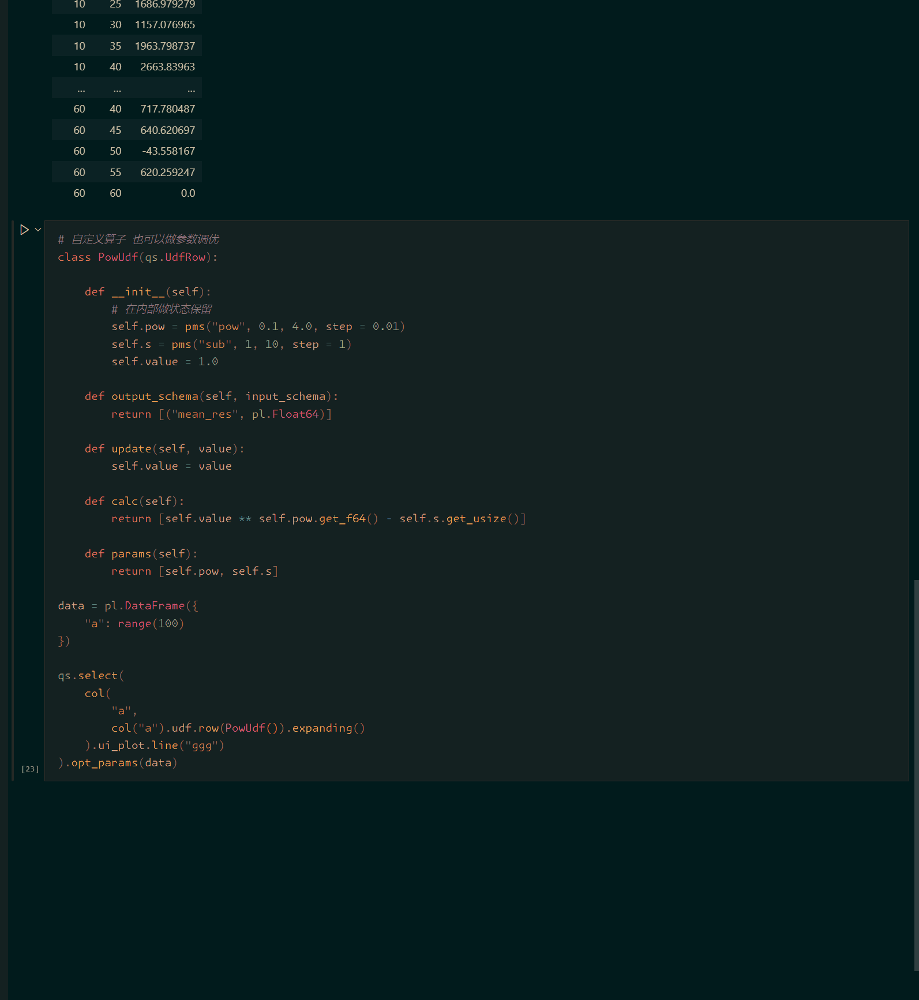
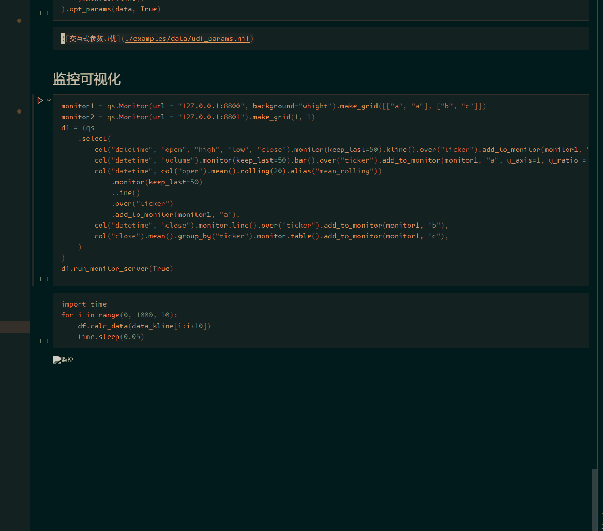
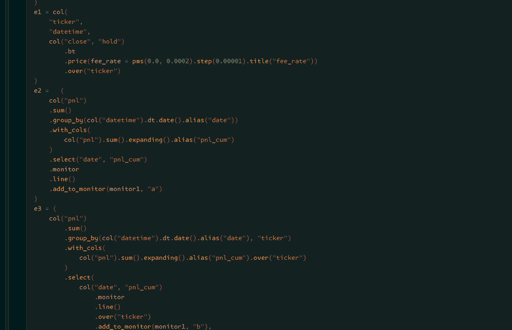

# Qust

支持流式计算的查询引擎，底层基于rust, 应用层用的python
------
* 流式计算，算子有状态保留，支持流式计算
* 性能高，大多数情况下速度比polars高，内存消耗更少
* 算子丰富，内置丰富的金融算子，比如k线合成、回测、组合优化等等
* 可拓展性强，底层基于rust的`datafusion`, 拓展到分布式很方便.

[文档地址](https://raw.githack.com/baiguoname/qust/main/examples/docs/qust.html)

[git地址](https://github.com/baiguoname/qust)

[demo地址](https://github.com/baiguoname/qust/blob/main/examples/demo.ipynb)

# 安装

```python
pip install -i https://pypi.tuna.tsinghua.edu.cn/simple qust
```
(只支持windows和linux)

# 目的

量化框架的不可能三角：

1. 高性能

2. 易用

3. 实盘回测一致

比如一些事件驱动的框架，优点是实盘回测一致，缺点是速度很慢， 而且不易用，毕竟操作 `DataFrame` 更加直观

还有一些向量化回测的框架, 优点是回测性能好，但是实盘回测不一致，而且从回测阶段转到实盘阶段比较麻烦

另外就是实盘和回测两套代码这种框架，这个不易用

总结下来就是，要想易用，就得用 `DataFrame` api 去做策略，要想实盘回测一致，就得用事件驱动

有没有方法能同时兼顾两者？有，用流式计算

底层用rust写就能实现高性能，api 封装成python的 `DataFrame` api 就能实现易用性，流式计算本身就是事件驱动，实盘回测就一致。qust的目的就是实现这个


# 使用


```python
import qust as qs
from qust import (col, pms)
import polars as pl
import numpy as np
```


```python
n = 10
data = pl.DataFrame({
    "factor": np.random.randn(n),
    "code": np.random.choice(["a", "b", "c"], size=n, replace=True),
})
data_next = pl.DataFrame({
    "factor": np.random.randn(n),
    "code": np.random.choice(["a", "b", "c"], size=n, replace=True),
})

df = qs.with_cols(
    col("factor").mean().expanding().alias("cum_mean"),
    col("factor").mean().rolling(3).alias("rolling_mean"),
    col("factor").mean().expanding().over("code").alias("cum_mean_over")
)
```


```python
print(df.calc_data(data))
```

    shape: (10, 5)
    ┌───────────┬──────┬───────────┬──────────────┬───────────────┐
    │ factor    ┆ code ┆ cum_mean  ┆ rolling_mean ┆ cum_mean_over │
    │ ---       ┆ ---  ┆ ---       ┆ ---          ┆ ---           │
    │ f64       ┆ str  ┆ f64       ┆ f64          ┆ f64           │
    ╞═══════════╪══════╪═══════════╪══════════════╪═══════════════╡
    │ -1.664883 ┆ b    ┆ -1.664883 ┆ null         ┆ -1.664883     │
    │ -0.187855 ┆ a    ┆ -0.926369 ┆ null         ┆ -0.187855     │
    │ -1.11352  ┆ b    ┆ -0.988753 ┆ -0.988753    ┆ -1.389201     │
    │ -1.212976 ┆ a    ┆ -1.044808 ┆ -0.838117    ┆ -0.700416     │
    │ 1.305776  ┆ b    ┆ -0.574692 ┆ -0.34024     ┆ -0.490876     │
    │ -0.418283 ┆ a    ┆ -0.548624 ┆ -0.108494    ┆ -0.606371     │
    │ -0.521383 ┆ b    ┆ -0.544732 ┆ 0.122036     ┆ -0.498503     │
    │ -2.068707 ┆ c    ┆ -0.735229 ┆ -1.002791    ┆ -2.068707     │
    │ -0.46641  ┆ a    ┆ -0.70536  ┆ -1.018833    ┆ -0.571381     │
    │ 1.223008  ┆ b    ┆ -0.512523 ┆ -0.437369    ┆ -0.1542       │
    └───────────┴──────┴───────────┴──────────────┴───────────────┘


```python
print(df.calc_data(data_next)) # df 里面的算子都状态保留
```

    shape: (10, 5)
    ┌───────────┬──────┬───────────┬──────────────┬───────────────┐
    │ factor    ┆ code ┆ cum_mean  ┆ rolling_mean ┆ cum_mean_over │
    │ ---       ┆ ---  ┆ ---       ┆ ---          ┆ ---           │
    │ f64       ┆ str  ┆ f64       ┆ f64          ┆ f64           │
    ╞═══════════╪══════╪═══════════╪══════════════╪═══════════════╡
    │ 1.040219  ┆ c    ┆ -0.371365 ┆ 0.598939     ┆ -0.514244     │
    │ -2.149415 ┆ c    ┆ -0.519536 ┆ 0.037937     ┆ -1.059301     │
    │ -1.031419 ┆ b    ┆ -0.558911 ┆ -0.713538    ┆ -0.300403     │
    │ 2.890776  ┆ c    ┆ -0.312505 ┆ -0.096686    ┆ -0.071782     │
    │ -0.710796 ┆ c    ┆ -0.339058 ┆ 0.382854     ┆ -0.199585     │
    │ -1.043864 ┆ a    ┆ -0.383108 ┆ 0.378705     ┆ -0.665878     │
    │ -0.784278 ┆ c    ┆ -0.406706 ┆ -0.846313    ┆ -0.297034     │
    │ -0.492146 ┆ c    ┆ -0.411453 ┆ -0.773429    ┆ -0.324907     │
    │ 1.290463  ┆ a    ┆ -0.321879 ┆ 0.00468      ┆ -0.339821     │
    │ -0.01888  ┆ c    ┆ -0.306729 ┆ 0.259812     ┆ -0.286653     │
    └───────────┴──────┴───────────┴──────────────┴───────────────┘


# 与polars语法比较


```python
data = pl.DataFrame({
    "price": range(5),
    "code": ["a", "a", "a", "b", "b"]
})
df = qs.with_cols(
    col("price").sum().expanding().alias("cum_sum_otters"),
    pl.col("price").cum_sum().alias("cum_sum_polars"),
    col("price").sum().expanding().over("code").alias("cum_sum_otters_over"),
    pl.col("price").cum_sum().over("code").alias("cum_sum_polars_over")
)
df.calc_data(data)
```


<div><style>
.dataframe > thead > tr,
.dataframe > tbody > tr {
  text-align: right;
  white-space: pre-wrap;
}
</style>
<small>shape: (5, 6)</small><table border="1" class="dataframe"><thead><tr><th>price</th><th>code</th><th>cum_sum_otters</th><th>cum_sum_polars</th><th>cum_sum_otters_over</th><th>cum_sum_polars_over</th></tr><tr><td>i64</td><td>str</td><td>i64</td><td>i64</td><td>i64</td><td>i64</td></tr></thead><tbody><tr><td>0</td><td>&quot;a&quot;</td><td>0</td><td>0</td><td>0</td><td>0</td></tr><tr><td>1</td><td>&quot;a&quot;</td><td>1</td><td>1</td><td>1</td><td>1</td></tr><tr><td>2</td><td>&quot;a&quot;</td><td>3</td><td>3</td><td>3</td><td>3</td></tr><tr><td>3</td><td>&quot;b&quot;</td><td>6</td><td>6</td><td>3</td><td>3</td></tr><tr><td>4</td><td>&quot;b&quot;</td><td>10</td><td>10</td><td>7</td><td>7</td></tr></tbody></table></div>


```python
# 广播
col("a") + col("b", "c")
col("a") > col("b", "c")
col("a", "b") + col("c", "d")
col("a", "b") + col("c")
col("a", "b") & col("c")
```

# 与polars性能比较


```python
import time
n = 2000000
data = pl.DataFrame({
    "factor": np.random.randn(n),
    "code": np.random.choice(["a", "b"], size=n, replace=True),
})
```

### 1. qust单线程 vs polars多线程


```python
s = time.time()
_ = qs.select(
    col("factor").rank().rolling(10).over("code")
).calc_data(data)
print(f"qust: {(time.time() - s) * 1000.0}.ms")

s = time.time()
_ = data.select(
    pl.col("factor").rolling_rank(10).over("code")
)
print(f"polars: {(time.time() - s) * 1000.0}.ms")
```

    qust: 104.89392280578613.ms
    polars: 194.35358047485352.ms


### 2. qust多线程 vs polars多线程


```python
s = time.time()
_ = qs.select(
    col(*[col("factor").mean().alias(f"mean_{i}") for i in range(50)]).rolling(10).over("code")
).calc_data(data)
print(f"qust: {(time.time() - s) * 1000.0}.ms")

s = time.time()
_ = data.select(
    [pl.col("factor").rolling_mean(10).over("code").alias(f"mean_{i}") for i in range(50)]
)
print(f"polars: {(time.time() - s) * 1000.0}.ms")
```

    qust: 137.73751258850098.ms
    polars: 382.92813301086426.ms


### 3. qust自定义算子 vs polars自定义算子


```python
class MeanUdf(qs.UdfRow):

    def __init__(self):
        self.sum = 0.0
        self.count = 0.0

    def output_schema(self, input_schema):
        return [("mean_res", pl.Float64)]
    
    def update(self, value):
        self.sum += value
        self.count += 1.0

    def calc(self):
        return [self.sum / self.count]

    def retract(self, value):
        self.sum -= value
        self.count -= 1.0

s = time.time()
_ = qs.select(
    col("factor").udf.row(MeanUdf()).rolling(10).over("code")
).calc_data(data)
print(f"qust: {(time.time() - s)}.s")

s = time.time()
_ = data.select(
    pl.col("factor").rolling_map(lambda x: x.mean(), 10).over("code")
)
print(f"polars: {(time.time() - s)}.s")
```

    qust: 1.3382771015167236.s
    polars: 51.07790398597717.s


>--------
| 算子 | qust | polars | 提速 |
|----|------|-------------|---|
| 单个算子 | 100ms | 157ms | 1.5倍 |
| 多个算子 | 110ms | 290ms | 2.5倍 |
| 自定义rolling算子 | 1.5s | 53s | 40倍 | 

# 和polars相互使用


```python
data = pl.DataFrame({
    "value": [1, 2, 3, 4, 5]
})
data_next = pl.DataFrame({
    "value": [3, 1, 10]
})
```

### 1. 在qust里面使用polars


```python
qs.with_cols(
    (pl.col("value") + 1).alias("value+1"),
    (col("value").pl + 2).alias("value+2"),
    col("value").mean().expanding().select(pl.col("value") - 1).alias("value-1")

).calc_data(data)
```


<div><style>
.dataframe > thead > tr,
.dataframe > tbody > tr {
  text-align: right;
  white-space: pre-wrap;
}
</style>
<small>shape: (5, 4)</small><table border="1" class="dataframe"><thead><tr><th>value</th><th>value+1</th><th>value+2</th><th>value-1</th></tr><tr><td>i64</td><td>i64</td><td>i64</td><td>f64</td></tr></thead><tbody><tr><td>1</td><td>2</td><td>3</td><td>0.0</td></tr><tr><td>2</td><td>3</td><td>4</td><td>0.5</td></tr><tr><td>3</td><td>4</td><td>5</td><td>1.0</td></tr><tr><td>4</td><td>5</td><td>6</td><td>1.5</td></tr><tr><td>5</td><td>6</td><td>7</td><td>2.0</td></tr></tbody></table></div>


### 2. 在polars里面使用qust


```python
data.select(
    col("value").mean().rolling(3).alias("value_mean1").pl,
    col("value").pl.rolling_mean(3).alias("value_mean2"),
)
```


<div><style>
.dataframe > thead > tr,
.dataframe > tbody > tr {
  text-align: right;
  white-space: pre-wrap;
}
</style>
<small>shape: (5, 2)</small><table border="1" class="dataframe"><thead><tr><th>value</th><th>value_mean2</th></tr><tr><td>f64</td><td>f64</td></tr></thead><tbody><tr><td>null</td><td>null</td></tr><tr><td>null</td><td>null</td></tr><tr><td>2.0</td><td>2.0</td></tr><tr><td>3.0</td><td>3.0</td></tr><tr><td>4.0</td><td>4.0</td></tr></tbody></table></div>


```python
# 上面的写法没有状态保留, 如果需要状态保留，需要把算子的状态保存到全局变量，使用 `expr.cache(id)`
e = col(
    col("value").mean().alias("mean"),
    col("value").sum().alias("sum"),
).rolling(3)
e_pl = e.cache("unique_id").pl
# 注意这里不能接polars的over，e.cache("unique_id").pl.over("code"), 这种写法会直接报错，
# 可以写成 e.over("code").cache("unique_id").pl, 或者用 data.qs.df
data.select(e_pl)
```


<div><style>
.dataframe > thead > tr,
.dataframe > tbody > tr {
  text-align: right;
  white-space: pre-wrap;
}
</style>
<small>shape: (5, 1)</small><table border="1" class="dataframe"><thead><tr><th>value</th></tr><tr><td>struct[2]</td></tr></thead><tbody><tr><td>{null,null}</td></tr><tr><td>{null,null}</td></tr><tr><td>{2.0,6}</td></tr><tr><td>{3.0,9}</td></tr><tr><td>{4.0,12}</td></tr></tbody></table></div>


```python
data_next.select(e_pl)
```


<div><style>
.dataframe > thead > tr,
.dataframe > tbody > tr {
  text-align: right;
  white-space: pre-wrap;
}
</style>
<small>shape: (3, 1)</small><table border="1" class="dataframe"><thead><tr><th>value</th></tr><tr><td>struct[2]</td></tr></thead><tbody><tr><td>{4.0,12}</td></tr><tr><td>{3.0,9}</td></tr><tr><td>{4.666667,14}</td></tr></tbody></table></div>


保存到全局的算子状态一直在内存里面，需要清除用:


```python
qs.clear_cache("unique_id") # 单个清除
qs.clear_cache() # 全部清除
```

由于polars的限制，上面的算子无法多列返回, 所以如果有多列返回，返回的是多列组成的struct

如果需要多列返回，只能这样写:


```python
data.qs.select(e)
```


<div><style>
.dataframe > thead > tr,
.dataframe > tbody > tr {
  text-align: right;
  white-space: pre-wrap;
}
</style>
<small>shape: (5, 2)</small><table border="1" class="dataframe"><thead><tr><th>mean</th><th>sum</th></tr><tr><td>f64</td><td>i64</td></tr></thead><tbody><tr><td>null</td><td>null</td></tr><tr><td>null</td><td>null</td></tr><tr><td>2.0</td><td>6</td></tr><tr><td>3.0</td><td>9</td></tr><tr><td>4.0</td><td>12</td></tr></tbody></table></div>


```python
df = qs.select(e)
data.qs.df(df)
```


<div><style>
.dataframe > thead > tr,
.dataframe > tbody > tr {
  text-align: right;
  white-space: pre-wrap;
}
</style>
<small>shape: (5, 2)</small><table border="1" class="dataframe"><thead><tr><th>mean</th><th>sum</th></tr><tr><td>f64</td><td>i64</td></tr></thead><tbody><tr><td>null</td><td>null</td></tr><tr><td>null</td><td>null</td></tr><tr><td>2.0</td><td>6</td></tr><tr><td>3.0</td><td>9</td></tr><tr><td>4.0</td><td>12</td></tr></tbody></table></div>


```python
data_next.qs.df(df)
```


<div><style>
.dataframe > thead > tr,
.dataframe > tbody > tr {
  text-align: right;
  white-space: pre-wrap;
}
</style>
<small>shape: (3, 2)</small><table border="1" class="dataframe"><thead><tr><th>mean</th><th>sum</th></tr><tr><td>f64</td><td>i64</td></tr></thead><tbody><tr><td>4.0</td><td>12</td></tr><tr><td>3.0</td><td>9</td></tr><tr><td>4.666667</td><td>14</td></tr></tbody></table></div>


# 为什么有polars，还要写qust？

### 1. 流式计算

写量化策略的时候，一般有下面两种方法

1. 向量化计算

2. 事件驱动

如果策略用向量化计算，在实盘的时候就很慢，因为要重复计算历史数据, 而且很多策略没法向量化

如果策略用的事件驱动，回测的时候就很慢，而且事件驱动写法特别麻烦

流计算就是把算子都写成事件驱动的形式。比如计算移动平均，在算子里面存储两个状态 `(sum, count)`, 每有一个行新数据`value`过来，更新算子的内部状态:

`sum = sum + value`

`count = count + 1`

在需要计算结果的时候就用  `sum / count`

```python
data = pl.DataFrame({
    "value": [1, 2, 3, 4, 5]
})
data_next = pl.DataFrame({
    "value": [6, 7, 8]
})

df = qs.with_cols(
    col("value").mean().rolling(3).alias("rolling_mean"),
    col("value").std().expanding().alias("cum_std"),
)

print(df.calc_data(data))
shape: (5, 3)
┌───────┬──────────────┬──────────┐
│ value ┆ rolling_mean ┆ cum_std  │
│ ---   ┆ ---          ┆ ---      │
│ i64   ┆ f64          ┆ f64      │
╞═══════╪══════════════╪══════════╡
│ 1     ┆ null         ┆ null     │
│ 2     ┆ null         ┆ 0.707107 │
│ 3     ┆ 2.0          ┆ 1.0      │
│ 4     ┆ 3.0          ┆ 1.290994 │
│ 5     ┆ 4.0          ┆ 1.581139 │
└───────┴──────────────┴──────────┘
print(df.calc_data(data_next))
shape: (3, 3)
┌───────┬──────────────┬──────────┐
│ value ┆ rolling_mean ┆ cum_std  │
│ ---   ┆ ---          ┆ ---      │
│ i64   ┆ f64          ┆ f64      │
╞═══════╪══════════════╪══════════╡
│ 6     ┆ 5.0          ┆ 1.870829 │
│ 7     ┆ 6.0          ┆ 2.160247 │
│ 8     ┆ 7.0          ┆ 2.44949  │
└───────┴──────────────┴──────────┘
```
在第一个调用`df.calc_data(data)`的时候，df内部的算子都有状态保留，所以在第二个调用`df.calc_data(data_next)`时候，没有重新计算

实际情况是，绝大多数算子都有对应的事件驱动形式，少量的算子比如`pl.col("a").rank()`, 看起来不是事件驱动的形式（当前行的值受到未来行的值的影响），但是其实也可以变换成事件驱动形式，
* 转换成行算子，比如 a 列有a1，a2，a3三个元素，就是`col(a1, a2, a3).rank(axis=1)` 

* 事件驱动形式的批算子，每次计算的时候保证传入的数据完整，比如计算`pl.col("a").rank().over("date")`, 保证每次计算传入的数据包含整天的所有数据

`polars`不是也支持streaming吗？我看了polars的底层，觉得polars的streaming不是真正意义上的流式计算，只是为了避免out of memory，而且局限性大(比如`over`是用的 切割 -> 计算 -> 拼接)。如果polars要实现真正的流式计算，我估计底层得推倒重来改成`datafusion`的那种框架


### 2. 表达式解耦

`polars`的`Expr`用的`enum`, 这样就导致每实现一个算子，底层很多代码都要改, 这样就不难理解为什么一个简单的`pl.col("a").rolling_rank(10)`算子直到最近才实现，而且速度比我一个简单的实现慢一倍。

`datafusion`聚合算子用的`Box<dyn trait>`, 然后根据上下文选择不同路径的`ExecutionPlan`, 这样添加算子很方便，而且优化路径也很清晰，性能还不受影响。

`polars`这种写法还有个缺点，就是导致同样的逻辑写法割裂，比如求和逻辑有下面写法:
* `pl.col("a").sum()`

* `pl.col("a").cum_sum()`

* `pl.col("a").rolling_sum(10)`

* `df.group_by("b").agg([pl.col("a").sum()])`

如果说 `sum()` 和 `rolling_sum(10)`, 都是求和逻辑, 前一个是针对整列，后一个是针对滚动，但是 `rank()`和`rolling_rank(10)`, 又是两个不想关的算子, 而且并不存在`cum_rank()`这个算子，这样逻辑就很割裂，为什么能存在`cum_sum`, 但是不能存在`cum_rank`, `cum_skew`, `cum_cov`? 

相反用`datafusion`的上下文逻辑，写法就比较一致:
* `col("a").sum()`

* `col("a").sum().expanding()`

* `col("a").sum().rolling(10)`

* `col("a").sum().group_by("b")`


### 3. 多列返回

`polars` 和 `datafusion` 对单个算子都不支持多列返回，但是`datafusion`提供了插件接口，能改成多列返回:
```python
n = 7
data = pl.DataFrame({
    "y": np.random.randn(n),
    "x1": np.random.randn(n),
    "x2": np.random.randn(n),
})
res = qs.with_cols(
    col("y", "x1", "x2").stock.ols().rolling(4).add_suffix("rolling_beta"),
).calc_data(data)
print(res)
shape: (7, 5)
┌───────────┬───────────┬───────────┬─────────────────┬─────────────────┐
│ y         ┆ x1        ┆ x2        ┆ x1_rolling_beta ┆ x2_rolling_beta │
│ ---       ┆ ---       ┆ ---       ┆ ---             ┆ ---             │
│ f64       ┆ f64       ┆ f64       ┆ f64             ┆ f64             │
╞═══════════╪═══════════╪═══════════╪═════════════════╪═════════════════╡
│ 0.522261  ┆ -0.376497 ┆ -0.594123 ┆ null            ┆ null            │
│ 1.325991  ┆ -0.723979 ┆ 2.626444  ┆ null            ┆ null            │
│ 1.502309  ┆ -2.089571 ┆ 0.28167   ┆ null            ┆ null            │
│ -0.322316 ┆ 0.00877   ┆ -0.213895 ┆ -0.731707       ┆ 0.271784        │
│ -0.733964 ┆ -0.750248 ┆ -0.592936 ┆ -0.47639        ┆ 0.465733        │
│ 0.445435  ┆ -0.559213 ┆ -0.44069  ┆ -0.56446        ┆ 1.174467        │
│ 1.735427  ┆ -2.403888 ┆ 1.207053  ┆ -0.29973        ┆ 0.849167        │
└───────────┴───────────┴───────────┴─────────────────┴─────────────────┘
```
多列返回我能想到以下好处
* 多列返回在用一些比如k线合成算子，策略信号算子之类的比较方便

* 另一个是避免用`struct`, 如果底层依赖从`arror-rs`改成[`MinArrow`](https://github.com/pbower/minarrow), 估计内存占用能到原来的一半，并且耗时减少

### 4. `datafusion` 功能更齐全，比如:
* 支持`DataFrame` Api 和 sql相互转换，`polars`不行

* 原生支持`arrow`, `datafusion`是`arrow`的一部分，未来生态会更丰富, `polars`自己写了一个`polars-arrow`, 生态割裂

* `datafusion` 有成熟的分布式应用，而且全部开源，`polars` 前期是基于`datafusion`的二次开发，目前分布式刚起步，而且闭源，貌似已经**把主要精力放在商业闭源上面去了**


当然，上面说的只是我个人的理解，对这方面有兴趣的朋友可以加我微信交流，微信号: aruster


# 写策略


```python
# 从github读取tick数据
data_kline = pl.read_parquet("https://github.com/baiguoname/qust/blob/main/examples/data/300_1min_vnpy.parquet?raw=true") # 从github读取数据，速度较慢
# 假设历史数据
data_his = data_kline[:600000]
# 假设实盘数据流
data_live = [data_kline[600000:601000], data_kline[601000:602000]]

# 从github读取kine数据
data_tick = pl.read_parquet("https://github.com/baiguoname/qust/blob/main/examples/data/data_tick.parquet?raw=true")
```

### 1. 有k线数据，实现一个双均线策略


```python
# 策略逻辑
stra = (
    col(
        col("close"),
        col("datetime"),
        col("close").stra.two_ma(10, 20), # 通过算子生成信号
    )
        .with_cols(col("cross_up", "cross_down").stra.to_hold_always().alias("hold")) # 通过信号生成目标持仓
)
# 回测
df_bt = qs.select(
    stra.with_cols(
        col("close", "hold").bt.price()
    ).expanding().select(
        col("datetime", "pnl").fp.group_pnl()
    )
)

# 实盘
df_live = qs.select(stra.expanding().select("hold").last_value())
```


```python
%%time
# 回测
df_bt.calc_data(data_his)
```

    CPU times: user 37.2 ms, sys: 37 ms, total: 74.2 ms
    Wall time: 49.3 ms


<div><style>
.dataframe > thead > tr,
.dataframe > tbody > tr {
  text-align: right;
  white-space: pre-wrap;
}
</style>
<small>shape: (2_500, 3)</small><table border="1" class="dataframe"><thead><tr><th>date</th><th>pnl</th><th>pnl_cum</th></tr><tr><td>date</td><td>f64</td><td>f64</td></tr></thead><tbody><tr><td>2009-01-05</td><td>22.14</td><td>22.14</td></tr><tr><td>2009-01-06</td><td>-2.74</td><td>19.4</td></tr><tr><td>2009-01-07</td><td>20.98</td><td>40.38</td></tr><tr><td>2009-01-08</td><td>39.31</td><td>79.69</td></tr><tr><td>2009-01-09</td><td>-2.92</td><td>76.77</td></tr><tr><td>&hellip;</td><td>&hellip;</td><td>&hellip;</td></tr><tr><td>2019-04-11</td><td>28.23</td><td>-2400.2</td></tr><tr><td>2019-04-12</td><td>-32.8</td><td>-2433.0</td></tr><tr><td>2019-04-15</td><td>26.66</td><td>-2406.34</td></tr><tr><td>2019-04-16</td><td>16.95</td><td>-2389.39</td></tr><tr><td>2019-04-17</td><td>-90.43</td><td>-2479.82</td></tr></tbody></table></div>


```python
# 实盘
import time
df_live.calc_data(data_his)
for data_live_ in data_live: # 模拟实盘数据流, 实际中应该用异步
    print(f"----接收到实盘数据, 实时数据长度: {data_live_.shape[0]}，开始一轮计算---")
    s = time.time()
    print(df_live.calc_data(data_live_))
    print(f"计算完成, 耗时: {time.time() - s}")
    print("------------------")
# 可以看到虽然历史数据需要几十万，但是每次实盘计算的时间很短，因为是流式计算
```

    ----接收到实盘数据, 实时数据长度: 1000，开始一轮计算---
    shape: (1, 1)
    ┌──────┐
    │ hold │
    │ ---  │
    │ f64  │
    ╞══════╡
    │ 1.0  │
    └──────┘
    计算完成, 耗时: 0.002280712127685547
    ------------------
    ----接收到实盘数据, 实时数据长度: 1000，开始一轮计算---
    shape: (1, 1)
    ┌──────┐
    │ hold │
    │ ---  │
    │ f64  │
    ╞══════╡
    │ 1.0  │
    └──────┘
    计算完成, 耗时: 0.001985788345336914
    ------------------


### 2. 有数据源，这个数据源不断获取多个品种的tick数据，策略需要分品种将数据不断合成1min k线，并且生成双均线的开仓逻辑，然后用0.01止损作为出场


```python
# 策略逻辑
col_tick = col("t", "c", "v", "bid1", "ask1", "bid1_v", "ask1_v")
stra = (
    col(
        col("c"),
        col("t"),
        col_tick.kline.future_ra1m.with_cols(
            col("close").stra.two_ma(10, 20).filter_cb("is_finished")
        ),
    ).with_cols(
        col(
            col("cross_up", "c").stra.exit_by_pct(0.01, False).alias("take_profit_long"),
            col("cross_up", "c").stra.exit_by_pct(0.01, True).alias("stop_loss_long"),
        )
            .with_cols(
                (pl.col("take_profit_long") | pl.col("stop_loss_long")).alias("exit_long_sig") 
            ),
        col(
            col("cross_down", "c").stra.exit_by_pct(0.01, True).alias("take_profit_short"),
            col("cross_down", "c").stra.exit_by_pct(0.01, False).alias("stop_loss_short"),
        )   
            .with_cols(
                (pl.col("take_profit_short") | pl.col("stop_loss_short")).alias("exit_short_sig")
            )
    ).with_cols(
        col("cross_up", "exit_long_sig", "cross_down", "exit_short_sig")
            .stra
            .to_hold_two_sides()
            .alias("hold")
    )
)

# 价格回测
df_bt_price = (qs
    .select(
        stra
            .with_cols(col("c", "hold").bt.price())
            .expanding()
            .over("ticker")
            .select(col("t", "pnl").fp.group_pnl())
    )
)

# tick回测
df_bt_tick = (qs.select(
    col(
        "bid1",
        "ask1",
        stra,
    )
        .with_cols(
            col("hold", "c", "bid1", "ask1")
                .bt
                .tick(qs.TradePriceType.queue, qs.MatchPriceType.simnow)
                # .tick(qs.TradePriceType.last_price, qs.MatchPriceType.void)
        )
        .expanding()
        .over("ticker")
        .select(col("t", "pnl").fp.group_pnl())
    )
)
```


```python
df_bt_price.calc_data(data_tick)
```


<div><style>
.dataframe > thead > tr,
.dataframe > tbody > tr {
  text-align: right;
  white-space: pre-wrap;
}
</style>
<small>shape: (23, 3)</small><table border="1" class="dataframe"><thead><tr><th>date</th><th>pnl</th><th>pnl_cum</th></tr><tr><td>date</td><td>f64</td><td>f64</td></tr></thead><tbody><tr><td>2024-01-06</td><td>11.0</td><td>11.0</td></tr><tr><td>2024-01-08</td><td>34.0</td><td>45.0</td></tr><tr><td>2024-01-09</td><td>68.0</td><td>113.0</td></tr><tr><td>2024-01-10</td><td>-8.0</td><td>105.0</td></tr><tr><td>2024-01-11</td><td>169.0</td><td>274.0</td></tr><tr><td>&hellip;</td><td>&hellip;</td><td>&hellip;</td></tr><tr><td>2024-01-27</td><td>4.0</td><td>515.0</td></tr><tr><td>2024-01-29</td><td>-69.0</td><td>446.0</td></tr><tr><td>2024-01-30</td><td>-21.0</td><td>425.0</td></tr><tr><td>2024-01-31</td><td>7.0</td><td>432.0</td></tr><tr><td>2024-02-01</td><td>-63.0</td><td>369.0</td></tr></tbody></table></div>


```python
df_bt_tick.calc_data(data_tick)
```


<div><style>
.dataframe > thead > tr,
.dataframe > tbody > tr {
  text-align: right;
  white-space: pre-wrap;
}
</style>
<small>shape: (23, 3)</small><table border="1" class="dataframe"><thead><tr><th>date</th><th>pnl</th><th>pnl_cum</th></tr><tr><td>date</td><td>f64</td><td>f64</td></tr></thead><tbody><tr><td>2024-01-06</td><td>0.0</td><td>0.0</td></tr><tr><td>2024-01-08</td><td>0.0</td><td>0.0</td></tr><tr><td>2024-01-09</td><td>116.0</td><td>116.0</td></tr><tr><td>2024-01-10</td><td>0.0</td><td>116.0</td></tr><tr><td>2024-01-11</td><td>0.0</td><td>116.0</td></tr><tr><td>&hellip;</td><td>&hellip;</td><td>&hellip;</td></tr><tr><td>2024-01-27</td><td>0.0</td><td>468.0</td></tr><tr><td>2024-01-29</td><td>-122.0</td><td>346.0</td></tr><tr><td>2024-01-30</td><td>0.0</td><td>346.0</td></tr><tr><td>2024-01-31</td><td>0.0</td><td>346.0</td></tr><tr><td>2024-02-01</td><td>-105.0</td><td>241.0</td></tr></tbody></table></div>


### 3. 一个更复杂的策略，接受tick数据，同时合成5min和30min的k线，双周期共振的均线策略


```python
# 策略逻辑
col_tick = col("t", "c", "v", "bid1", "ask1", "bid1_v", "ask1_v")
stra =  (
    col(
        col("c"),
        col("t"),
        col_tick.kline.rl5m
            .with_cols(
                col("close").stra.two_ma(10, 20).filter_cb("is_finished")
            )
            .add_suffix("m5"),
        col_tick.kline.rl30m
            .with_cols(
                col("close").stra.two_ma(10, 20).filter_cb("is_finished")
            )
            .add_suffix("m30")
    )
        .with_cols(
            col("cross_up_m30", "cross_down_m30").ffill()
        )
        .with_cols(
            col(pl.col("cross_up_m5") & pl.col("cross_up_m30")).alias("open_long_sig"),
            col(pl.col("cross_down_m5") & pl.col("cross_down_m30")).alias("open_short_sig"),
        )
        .with_cols(
            col(
                col("open_long_sig", "c").stra.exit_by_pct(0.05, False).alias("take_profit_long"),
                col("open_long_sig", "c").stra.exit_by_pct(0.02, True).alias("stop_loss_long"),
            )
                .select(
                    (pl.col("take_profit_long") | pl.col("stop_loss_long")).alias("exit_long_sig") 
                ),
            col(
                col("open_short_sig", "c").stra.exit_by_pct(0.05, True).alias("take_profit_short"),
                col("open_short_sig", "c").stra.exit_by_pct(0.02, False).alias("stop_loss_short"),
            )   
                .select(
                    (pl.col("take_profit_short") | pl.col("stop_loss_short")).alias("exit_short_sig")
                )
        )
        .with_cols(
            col("open_long_sig", "exit_long_sig", "open_short_sig", "exit_short_sig")
                .stra
                .to_hold_two_sides()
                .alias("hold")
        )
)

# tick回测逻辑
df_bt_tick = (
    qs.select(
        col(
            "bid1",
            "ask1",
            stra,
        )
            .with_cols(
                col("hold", "c", "bid1", "ask1")
                    .bt
                    .tick(qs.TradePriceType.queue, qs.MatchPriceType.simnow)
                    # .backtest_tick(qs.TradePriceType.last_price, qs.MatchPriceType.void)
            )
            .expanding()
            .over("ticker")
            .select(
                col("t", "pnl").fp.group_pnl()
            )
    )
)
```


```python
df_bt_tick.calc_data(data_tick)
```


<div><style>
.dataframe > thead > tr,
.dataframe > tbody > tr {
  text-align: right;
  white-space: pre-wrap;
}
</style>
<small>shape: (23, 3)</small><table border="1" class="dataframe"><thead><tr><th>date</th><th>pnl</th><th>pnl_cum</th></tr><tr><td>date</td><td>f64</td><td>f64</td></tr></thead><tbody><tr><td>2024-01-06</td><td>0.0</td><td>0.0</td></tr><tr><td>2024-01-08</td><td>0.0</td><td>0.0</td></tr><tr><td>2024-01-09</td><td>0.0</td><td>0.0</td></tr><tr><td>2024-01-10</td><td>0.0</td><td>0.0</td></tr><tr><td>2024-01-11</td><td>0.0</td><td>0.0</td></tr><tr><td>&hellip;</td><td>&hellip;</td><td>&hellip;</td></tr><tr><td>2024-01-27</td><td>0.0</td><td>-119.0</td></tr><tr><td>2024-01-29</td><td>0.0</td><td>-119.0</td></tr><tr><td>2024-01-30</td><td>0.0</td><td>-119.0</td></tr><tr><td>2024-01-31</td><td>0.0</td><td>-119.0</td></tr><tr><td>2024-02-01</td><td>0.0</td><td>-119.0</td></tr></tbody></table></div>


### 4. 使用内置的策略


```python
(qs
    .with_cols(
        col("high", "low", "close").stra.c66()
    )
    .select(pl.all().qs.fp.bt(fee_rate = 0.0000)) # 只是做示例用，没有手续费
    .calc_data(data_kline)
    .qs
    ._line()
)
```

### 5. 内置的tick因子与内置的k线策略结合


```python
(qs
    .with_cols(
        col("t", "c", "v", "bid1", "ask1", "bid1_v", "ask1_v")
            .kline
            .rl1m
            .expanding()
    )
    .with_cols(
        col("high", "low", "close")
            .stra
            .c66()
            .filter_cb("is_finished")
    )
    .with_cols(
        col("c", "v", "bid1", "ask1")
            .ta
            .order_flow_gap
            .rolling(2000)
            .with_cols(
                (pl.col("of_gap") > 100).alias("open_long_sig_of"),
                (pl.col("of_gap") < -100).alias("open_short_sig_of"),
            )
    )
    .with_cols(
        (pl.col("open_long_sig") & pl.col("open_long_sig_of")).alias("open_long_sig"),
        (pl.col("open_short_sig") & pl.col("open_short_sig_of")).alias("open_short_sig"),
    )
    .select(pl.all().qs.fp.bt(-1.0, 1.0))
    .calc_data(data_tick)
)
```


<div><style>
.dataframe > thead > tr,
.dataframe > tbody > tr {
  text-align: right;
  white-space: pre-wrap;
}
</style>
<small>shape: (23, 3)</small><table border="1" class="dataframe"><thead><tr><th>date</th><th>pnl</th><th>pnl_cum</th></tr><tr><td>date</td><td>f64</td><td>f64</td></tr></thead><tbody><tr><td>2024-01-06</td><td>0.0</td><td>0.0</td></tr><tr><td>2024-01-08</td><td>0.0</td><td>0.0</td></tr><tr><td>2024-01-09</td><td>18.0</td><td>18.0</td></tr><tr><td>2024-01-10</td><td>8801.0</td><td>8819.0</td></tr><tr><td>2024-01-11</td><td>2285.0</td><td>11104.0</td></tr><tr><td>&hellip;</td><td>&hellip;</td><td>&hellip;</td></tr><tr><td>2024-01-27</td><td>0.0</td><td>39071.0</td></tr><tr><td>2024-01-29</td><td>0.0</td><td>39071.0</td></tr><tr><td>2024-01-30</td><td>-15.0</td><td>39056.0</td></tr><tr><td>2024-01-31</td><td>0.0</td><td>39056.0</td></tr><tr><td>2024-02-01</td><td>-19.0</td><td>39037.0</td></tr></tbody></table></div>


### 6. 自定义行计算

`qust`底层用的rust，性能有保障，但是不能也没有必要覆盖所有的情况，所以自定义算子很重要。

实现一个自定义的算子之后，这个算子就能像内置算子那样在各种上下文计算，比如`rolling`, `group_by`, `over`之类

虽然目前自定义的行算子比polars要高出很多倍（见上面的测试），但是毕竟比rust慢，所以最好是在策略的最后阶段比如仓位管理之类的时候去自定义行算子


```python
# 例子1，自定义一个均线计算
class MeanUdf(qs.UdfRow):

    def __init__(self):
        # 在内部做状态保留
        self.sum = 0.0
        self.count = 0.0

    def output_schema(self, input_schema):
        return [("mean_res", pl.Float64)]
    
    # 更新数据
    # value来自于输入的每一行
    # col("a") => update(self, a_value)
    # col("a", "b") => update(self, a_value, b_value)
    def update(self, value):
        self.sum += value
        self.count += 1.0

    # 计算结果，必须要返回一个list
    def calc(self):
        return [self.sum / self.count]

    # 如果需要支持rolling，必须要实现这个方法，说明怎么滚动
    def retract(self, value):
        self.sum -= value
        self.count -= 1.0

import numpy as np
n = 1000
data_test = pl.DataFrame({
    "value": np.random.randn(n),
    "code": np.random.choice(["a", "b", "c"], size=n, replace=True),
    "window": np.random.choice([10, 5, 2], size = n, replace=True),
    "intra_day": np.random.choice([True, False], size = n, replace=True)
})

e = col("value").udf.row(MeanUdf())

# 自定义的行算子可以在各类上下文中使用
qs.with_cols(
    e.expanding().alias("expanding"),
    e.rolling(10).alias("rolling"),
    e.rolling_dynamic("window").alias("rolling_dynamic"),
    e.rolling_intra_day("intra_day", 3).alias("rolling_intraday"),
    e.expanding().alias("expanding").over("code").add_suffix("over"),
    e.rolling(10).alias("rolling").over("code").add_suffix("over"),
    e.rolling_dynamic("window").alias("rolling_dynamic").add_suffix("over"),
    e.rolling_intra_day("intra_day", 3).alias("rolling_intraday").add_suffix("over"),
).calc_data(data_test)
```


<div><style>
.dataframe > thead > tr,
.dataframe > tbody > tr {
  text-align: right;
  white-space: pre-wrap;
}
</style>
<small>shape: (1_000, 12)</small><table border="1" class="dataframe"><thead><tr><th>value</th><th>code</th><th>window</th><th>intra_day</th><th>expanding</th><th>rolling</th><th>rolling_dynamic</th><th>rolling_intraday</th><th>expanding_over</th><th>rolling_over</th><th>rolling_dynamic_over</th><th>rolling_intraday_over</th></tr><tr><td>f64</td><td>str</td><td>i64</td><td>bool</td><td>f64</td><td>f64</td><td>f64</td><td>f64</td><td>f64</td><td>f64</td><td>f64</td><td>f64</td></tr></thead><tbody><tr><td>0.696872</td><td>&quot;b&quot;</td><td>10</td><td>true</td><td>0.696872</td><td>null</td><td>0.696872</td><td>null</td><td>0.696872</td><td>null</td><td>0.696872</td><td>null</td></tr><tr><td>-1.939854</td><td>&quot;a&quot;</td><td>5</td><td>false</td><td>-0.621491</td><td>null</td><td>-0.621491</td><td>null</td><td>-1.939854</td><td>null</td><td>-0.621491</td><td>null</td></tr><tr><td>0.138143</td><td>&quot;a&quot;</td><td>10</td><td>false</td><td>-0.36828</td><td>null</td><td>-0.36828</td><td>null</td><td>-0.900855</td><td>null</td><td>-0.36828</td><td>null</td></tr><tr><td>-0.767553</td><td>&quot;b&quot;</td><td>10</td><td>false</td><td>-0.468098</td><td>null</td><td>-0.468098</td><td>null</td><td>-0.035341</td><td>null</td><td>-0.468098</td><td>null</td></tr><tr><td>1.416855</td><td>&quot;b&quot;</td><td>10</td><td>false</td><td>-0.091107</td><td>null</td><td>-0.091107</td><td>null</td><td>0.448725</td><td>null</td><td>-0.091107</td><td>null</td></tr><tr><td>&hellip;</td><td>&hellip;</td><td>&hellip;</td><td>&hellip;</td><td>&hellip;</td><td>&hellip;</td><td>&hellip;</td><td>&hellip;</td><td>&hellip;</td><td>&hellip;</td><td>&hellip;</td><td>&hellip;</td></tr><tr><td>2.182275</td><td>&quot;b&quot;</td><td>10</td><td>false</td><td>-0.01541</td><td>-0.146151</td><td>-0.146151</td><td>0.385357</td><td>-0.015211</td><td>0.188536</td><td>-0.146151</td><td>0.385357</td></tr><tr><td>-0.608805</td><td>&quot;a&quot;</td><td>5</td><td>true</td><td>-0.016005</td><td>-0.018531</td><td>0.072781</td><td>-0.545003</td><td>-0.071509</td><td>0.153087</td><td>0.072781</td><td>-0.545003</td></tr><tr><td>-0.48438</td><td>&quot;c&quot;</td><td>5</td><td>true</td><td>-0.016474</td><td>-0.068051</td><td>0.185705</td><td>-0.537445</td><td>0.038567</td><td>-0.488541</td><td>0.185705</td><td>-0.537445</td></tr><tr><td>0.226195</td><td>&quot;c&quot;</td><td>2</td><td>false</td><td>-0.016232</td><td>-0.034897</td><td>-0.129093</td><td>-0.288997</td><td>0.039111</td><td>-0.539205</td><td>-0.129093</td><td>-0.288997</td></tr><tr><td>3.578359</td><td>&quot;a&quot;</td><td>5</td><td>true</td><td>-0.012637</td><td>0.373645</td><td>0.978729</td><td>0.828391</td><td>-0.06114</td><td>0.471257</td><td>0.978729</td><td>0.828391</td></tr></tbody></table></div>


```python
# 例子2，利用自定义行算子实现一个马丁策略
class MartinGillStra(qs.UdfRow):
    # 用python自定义行算子，实现一个马丁格尔策略

    # 策略的输入
    # -----
    # col(price, line_down_std2, line_down_std1, line_middle, line_up_std1, line_up_std2)

    # price: k线价格

    # line_down_std2: k线形成的最低线

    # line_down_std1: k线形成的中下线

    # line_middle: k线的中间线

    # line_up_std1: k线形成的中上线

    # line_up_std2: k线形成的最高线

    # 策略逻辑
    # ------

    # price 处于 [line_middle, line_up_std1], 目标仓位1，
    # price 处于 [line_middle, line_up_std2], 目标仓位2,
    # price 处于 [line_up_std2, inf], 目标仓位3，
    # 反过来就是 -1， -2， -3

    # 输出
    # ------
    # col(target)
    # target: 目标仓位

    def __init__(self):
        self.last_hold = 0.0

    def output_schema(self, input_schema):
        return [("hold", pl.Float64)]

    def update(self, price, down_std2, down_std1, middle, up_std1, up_std2):
        # 如果能够保证输入没有null，可以去除这个检查，性能有提升
        if price is None or down_std2 is None or down_std1 is None or middle is None or up_std1 is None or up_std2 is None:
            return None
        if price <= down_std2:
            self.last_hold = -3.0
        elif down_std2 < price <= down_std1:
            self.last_hold = -2.0
        elif down_std1 < price <= middle:
            self.last_hold = -1.0
        elif middle < price < up_std1:
            self.last_hold = 1.0
        elif up_std1 <= price < up_std2:
            self.last_hold = 2.0
        elif up_std2 <= price:
            self.last_hold = 3.0

    def calc(self):
        return [self.last_hold]

(qs
    .with_cols(
        col(
            col("close").alias("price"),
            col("close").mean().alias("middle"),
            col("close").std().alias("std"),
        )
            .rolling(20, 1)
            .select(
                col(
                    "price",
                    (pl.col("middle") - 2.0 * pl.col("std")).alias("a"),
                    (pl.col("middle") - 1.0 * pl.col("std")).alias("b"),
                    "middle",
                    (pl.col("middle") + 1.0 * pl.col("std")).alias("c"),
                    (pl.col("middle") + 2.0 * pl.col("std")).alias("d"),
                )
                    .udf
                    .row(MartinGillStra())
            )
            .expanding()
    )
    .with_cols(
        col("close", "hold")
            .bt
            .price(fee_rate=0.0002)
            .expanding()
    )
    .select(
        col("datetime", "pnl").fp.group_pnl()
    )
    .calc_data(data_kline)
    # .qs
    # ._line(width = 800, height = 500)
)
```

# 参数调优

`qust`中可以做可视化+交互式参数调优，只需要把原来的表达式中的固定参数换成范围参数，比如

`col("a").mean().rolling(10)` 

替换成

`col("a").mean().rolling(pms("rolling_mean", 10, 20, step = 1))`

底层会自动找到所有的范围参数


```python
data_kline = pl.read_parquet("https://github.com/baiguoname/qust/blob/main/examples/data/data_kline2.parquet?raw=true") 
# 从github读取数据，速度较慢, 建议用自己的数据
```


```python
stra = (
    col(
        "ticker",
        "close",
        "datetime",
        col("close").stra.two_ma(pms(10, 60).title("short").step(5), pms(20, 60).title("long").step(5)), # 通过算子生成信号
    )
        .with_cols(col("cross_up", "cross_down").stra.to_hold_always().alias("hold")) # 通过信号生成目标持仓
)
# 回测
df_bt = (qs
    .select(
        stra
            .with_cols(
                col("close", "hold")
                    .bt
                    # .price(fee_rate = pms("fee_rate", 0.0, 0.0002, step = 0.00001))
                    .price(fee_rate = 0.0)
            )
            .expanding()
            .over("ticker")
            .select(
                col("pnl", "fee")
                    .sum()
                    .group_by("ticker", pl.col("datetime").dt.date().alias("date"))
            )
            .with_cols(
                col("date", col("pnl").sum().expanding())
                    .monitor
                    .line()
                    .over("ticker")
            )
            .select(
                col("fee", "pnl")
                    .sum()
                    .group_by("date")
                    .select(
                        col("date", col("pnl").sum().expanding()).monitor.line(),
                    ),
                col("fee", "pnl")
                    .sum()
                    .group_by("ticker")
                    .select(
                        col("ticker", "pnl", "fee").monitor.bar(),
                    ),
                col("pnl").sum().monitor.table(),
                col("pnl").sum(),
            )
    )
)
```


```python
df_bt.opt_params(data_kline, True)
```


```python
pl.read_parquet("all_res.parquet")
```


<div><style>
.dataframe > thead > tr,
.dataframe > tbody > tr {
  text-align: right;
  white-space: pre-wrap;
}
</style>
<small>shape: (99, 3)</small><table border="1" class="dataframe"><thead><tr><th>short</th><th>long</th><th>pnl</th></tr><tr><td>u32</td><td>u32</td><td>f64</td></tr></thead><tbody><tr><td>10</td><td>20</td><td>461.836823</td></tr><tr><td>10</td><td>25</td><td>1686.979279</td></tr><tr><td>10</td><td>30</td><td>1157.076965</td></tr><tr><td>10</td><td>35</td><td>1963.798737</td></tr><tr><td>10</td><td>40</td><td>2663.83963</td></tr><tr><td>&hellip;</td><td>&hellip;</td><td>&hellip;</td></tr><tr><td>60</td><td>40</td><td>717.780487</td></tr><tr><td>60</td><td>45</td><td>640.620697</td></tr><tr><td>60</td><td>50</td><td>-43.558167</td></tr><tr><td>60</td><td>55</td><td>620.259247</td></tr><tr><td>60</td><td>60</td><td>0.0</td></tr></tbody></table></div>


```python
# 也可以直接循环所有参数
df_bt.loop_all_params(data_kline)
```


<div><style>
.dataframe > thead > tr,
.dataframe > tbody > tr {
  text-align: right;
  white-space: pre-wrap;
}
</style>
<small>shape: (99, 3)</small><table border="1" class="dataframe"><thead><tr><th>short</th><th>long</th><th>pnl</th></tr><tr><td>u32</td><td>u32</td><td>f64</td></tr></thead><tbody><tr><td>10</td><td>20</td><td>461.836823</td></tr><tr><td>10</td><td>25</td><td>1686.979279</td></tr><tr><td>10</td><td>30</td><td>1157.076965</td></tr><tr><td>10</td><td>35</td><td>1963.798737</td></tr><tr><td>10</td><td>40</td><td>2663.83963</td></tr><tr><td>&hellip;</td><td>&hellip;</td><td>&hellip;</td></tr><tr><td>60</td><td>40</td><td>717.780487</td></tr><tr><td>60</td><td>45</td><td>640.620697</td></tr><tr><td>60</td><td>50</td><td>-43.558167</td></tr><tr><td>60</td><td>55</td><td>620.259247</td></tr><tr><td>60</td><td>60</td><td>0.0</td></tr></tbody></table></div>


```python
# 自定义算子 也可以做参数调优
class PowUdf(qs.UdfRow):

    def __init__(self):
        # 在内部做状态保留
        self.pow = pms(0.1, 4.0).title("pow").step(0.1)
        self.s = pms(1, 10).title("sum").step(1)
        self.value = 1.0

    def output_schema(self, input_schema):
        return [("mean_res", pl.Float64)]
    
    def update(self, value):
        self.value = value

    def calc(self):
        return [self.value ** self.pow.get_f64() - self.s.get_usize()]

    def params(self):
        return [self.pow, self.s]

data = pl.DataFrame({
    "a": range(100)
})

qs.select(
    col(
        "a", 
        col("a").udf.row(PowUdf()).expanding()
    ).monitor.line()
).opt_params(data, True)
```



# 监控可视化


```python
monitor1 = qs.Monitor(url = "127.0.0.1:8800", background="whight").make_grid([["a", "a"], ["b", "c"]])
monitor2 = qs.Monitor(url = "127.0.0.1:8801").make_grid(1, 1)
df = (qs
    .select(
        col("datetime", "open", "high", "low", "close").monitor(keep_last=50).kline().over("ticker").add_to_monitor(monitor1, "a"),
        col("datetime", "volume").monitor(keep_last=50).bar().over("ticker").add_to_monitor(monitor1, "a", y_axis=1, y_ratio = -0.2),
        col("datetime", col("open").mean().rolling(20).alias("mean_rolling"))
            .monitor(keep_last=50)
            .line()
            .over("ticker")
            .add_to_monitor(monitor1, "a"),
        col("datetime", "close").monitor.line().over("ticker").add_to_monitor(monitor1, "b"),
        col("close").mean().group_by("ticker").monitor.table().add_to_monitor(monitor1, "c"),
    )     
)
df.run_monitor_server(True)
```


```python
import time
for i in range(0, 1000, 10):
    df.calc_data(data_kline[i:i+10])
    time.sleep(0.05)
```



# 内置策略

1. CTA信号类策略

我用codex翻译了100多个cta信号策略，获取方法：

`qs.future.Stra.get_all_sig_stras()`

具体的策略实现逻辑见[cta信号类策略链接](https://github.com/baiguoname/qust/blob/main/examples/stra_assets.py)

一个策略其实就是一个算子，可以方便验证不同策略在不同数据源上的应用，比如


```python
data_kline = pl.read_parquet("https://github.com/baiguoname/qust/blob/main/examples/data/data_kline2.parquet?raw=true") 
```


```python
monitor1 = qs.Monitor(url = "127.0.0.1:8800", background="black").make_grid([["a", "a"], ["b", "c"]])
e0 = (
    col("open_long_sig", "exit_long_sig" , "open_short_sig", "exit_short_sig")
        .stra
        .to_hold_two_sides()
        .expanding()
        .alias("hold")
        .over("ticker")
)
e1 = col(
    "ticker",
    "datetime",
    col("close", "hold")
        .bt
        .price(fee_rate = pms(0.0, 0.0002).step(0.00001).title("fee_rate"))
        .over("ticker")
)
e2 =   (
    col("pnl")
    .sum()
    .group_by(col("datetime").dt.date().alias("date"))
    .with_cols(
        col("pnl").sum().expanding().alias("pnl_cum")
    )
    .select("date", "pnl_cum")
    .monitor
    .line()
    .add_to_monitor(monitor1, "a")
)
e3 = (
    col("pnl")
        .sum()
        .group_by(col("datetime").dt.date().alias("date"), "ticker")
        .with_cols(
            col("pnl").sum().expanding().alias("pnl_cum").over("ticker")
        )
        .select(
            col("date", "pnl_cum")
                .monitor
                .line()
                .over("ticker")
                .add_to_monitor(monitor1, "b"),
        )
)
df = qs.with_cols(
    col.all.stra.stra_select(qs.future.Stra.get_all_sig_stras()).over("ticker")
).with_cols(e0).select(e1).select(e2, e3)
df.opt_params(data_kline, True)
```



也可以对两个策略测试信号融合


```python
monitor1 = qs.Monitor(url = "127.0.0.1:8800", background="black").make_grid([["a", "a"], ["b", "c"]])
df = qs.with_cols(
    col(
        col.all.stra.stra_select(qs.future.Stra.get_all_sig_stras(), "算子1").over("ticker").add_suffix("1"),
        col.all.stra.stra_select(qs.future.Stra.get_all_sig_stras(), "算子2").over("ticker").add_suffix("2"),
    ).select(
        (col("open_long_sig_1") & col("open_long_sig_2")).alias("open_long_sig"),
        (col("open_short_sig_1") & col("open_short_sig_2")).alias("open_short_sig"),
        (col("exit_long_sig_1") | col("exit_long_sig_2")).alias("exit_long_sig"),
        (col("exit_short_sig_1") | col("exit_short_sig_2")).alias("exit_short_sig"),
    )
).with_cols(e0).select(e1).select(e2, e3)
df.opt_params(data_kline, True)
```

就像要codex直接写代码，codex会给你整坨大的, 但是给codex定很多约束，codex写的代码质量出奇的好

同样，直接叫ai去写策略，有点困难；但是如果给ai很多算子，并且告诉ai这些算子的作用，然后要ai整夜给你跑，组合出一个好的策略，说不定ai有奇效

这个时候就能体现出算子组合写策略的优势了
