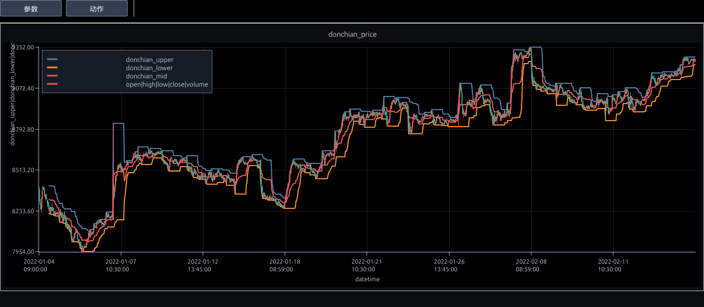
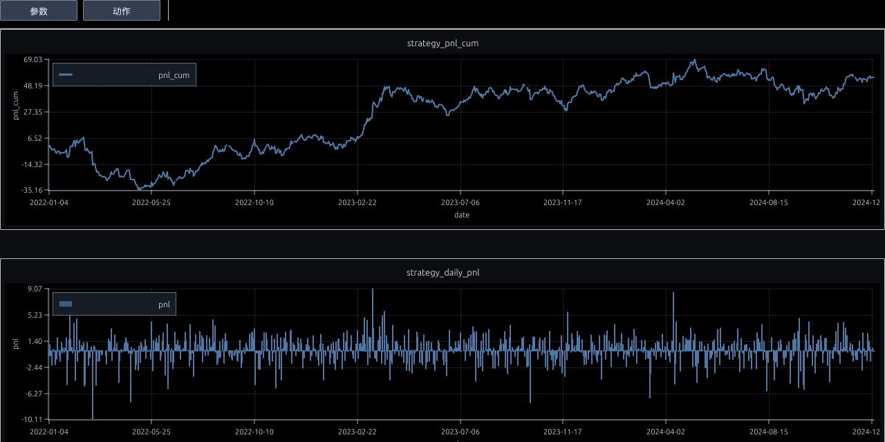

# Donchian Channels：用 qust 计算价格通道

[项目地址](https://baiguoname.github.io/qust/site) · [git地址](https://github.com/baiguoname/qust)


来源参考：[Investopedia](https://www.investopedia.com/terms/d/donchianchannels.asp)

本节按 Investopedia 原页面的信息结构做完整中文改写，并把指标定义落成 `col(...).investopedia.xxx(...)` 的一行调用。能用 qust 现有 rolling、shift、select、with_cols、over 组合的就直接组合；需要 pivot/形态扫描的部分由 Rust helper 完成，Python 端不写 UDF。


## 1. Investopedia 原文内容完整改写：Donchian Channels

### 什么是 Donchian Channels
Donchian Channels 是由过去一段时间最高价和最低价构成的价格通道。上轨是过去 N 期最高 high，下轨是过去 N 期最低 low，中轨通常是上轨和下轨的平均值。它把“最近价格运行区间”画成一个清晰的上下边界。

### 指标来源和用途
Donchian Channels 常和趋势跟随交易联系在一起。它的思想很直接：如果价格突破过去一段时间的最高价，说明价格进入新的上方区间；如果跌破过去一段时间最低价，说明价格进入新的下方区间。交易者可以用它观察突破，也可以用通道宽度观察波动。

### 公式
设回看周期为 N：上轨等于最近 N 期 high 的最大值；下轨等于最近 N 期 low 的最小值；中轨等于上下轨之和除以 2。这个公式不需要复杂统计，只依赖 rolling max/min。

### 如何解读
价格贴近或突破上轨，说明当前价格处在近期强势区域；价格贴近或跌破下轨，说明当前价格处在近期弱势区域。通道变宽通常代表波动扩大，通道变窄代表波动收缩。不同交易者会把突破看成趋势开始，也可能把通道边缘看作超买超卖参考。

### 参数影响
周期越短，通道越贴近价格，信号更敏感；周期越长，通道更稳定，突破更少但滞后更大。常见示例会使用 20 期，但真实使用时应根据数据周期和品种波动调整。

### 局限性
Donchian Channels 只告诉你过去 N 期的最高和最低，不知道突破是真趋势还是假突破。在震荡市场里，价格可能频繁穿越上下轨导致来回亏损。因此通常需要结合趋势过滤、成交量、止损或资金管理。

## 2. 从文章到 qust 算子的落地

这个指标完全可以由现有 rolling 算子组合完成，不需要 Rust helper。qust 输出 `donchian_upper/lower/mid` 三列，后面可以直接画线或和 close 比较生成突破条件。

## 3. qust 一行调用

```python
col("high", "low").investopedia.donchian_channels(period=20)
```

输入列顺序：`high, low`。

输出列：`donchian_upper`, `donchian_lower`, `donchian_mid`。

这些输出都保持和输入相同的行数，后面可以继续 `.with_cols(...)`、`.filter(...)`、`.monitor...`，也可以接 `.over("ticker", "ct")` 按合约独立计算。


```python
import qust as qs
import qust.future.future  # 注册 bt/stra/kline/fp 等金融命名空间
import qust.investopedia  # 注册 investopedia 命名空间
from qust import col, mark_shape
from qust._polars import pl

pl.Config.set_tbl_rows(16)
pl.Config.set_tbl_cols(28)

DATA_PATH = "https://github.com/baiguoname/qust/blob/main/examples/data/data_kline3.parquet?raw=true"
PLOT_TICKER = "AP"

```


```python
raw = pl.read_parquet(DATA_PATH).sort(["ticker", "ct", "datetime"])

base_contract = (
    raw
    .filter(pl.col("ticker") == PLOT_TICKER)
    .select("ct")
    .unique()
    .sort("ct")
    .get_column("ct")[0]
)

print("raw shape:", raw.shape)
print("tickers:", raw.select(pl.col("ticker").unique().sort()).to_series().to_list())
print("contract count:", raw.select("ticker", "ct").unique().height)
print("default plot ticker/ct:", PLOT_TICKER, base_contract)
raw.head(5)

```

    raw shape: (408782, 8)
    tickers: ['AP', 'RM', 'SA', 'al', 'eb', 'eg', 'fu', 'rb']
    contract count: 141
    default plot ticker/ct: AP 205


<div><style>
.dataframe > thead > tr,
.dataframe > tbody > tr {
  text-align: right;
  white-space: pre-wrap;
}
</style>
<small>shape: (5, 8)</small><table border="1" class="dataframe"><thead><tr><th>ticker</th><th>ct</th><th>datetime</th><th>open</th><th>high</th><th>low</th><th>close</th><th>volume</th></tr><tr><td>str</td><td>i32</td><td>datetime[ms]</td><td>f64</td><td>f64</td><td>f64</td><td>f64</td><td>f64</td></tr></thead><tbody><tr><td>&quot;AP&quot;</td><td>205</td><td>2022-01-04 09:00:00</td><td>8394.0</td><td>8394.0</td><td>8392.0</td><td>8392.0</td><td>1100.0</td></tr><tr><td>&quot;AP&quot;</td><td>205</td><td>2022-01-04 09:05:00</td><td>8385.0</td><td>8389.0</td><td>8348.0</td><td>8378.0</td><td>11169.0</td></tr><tr><td>&quot;AP&quot;</td><td>205</td><td>2022-01-04 09:10:00</td><td>8375.0</td><td>8376.0</td><td>8298.0</td><td>8302.0</td><td>14001.0</td></tr><tr><td>&quot;AP&quot;</td><td>205</td><td>2022-01-04 09:15:00</td><td>8301.0</td><td>8315.0</td><td>8271.0</td><td>8280.0</td><td>12839.0</td></tr><tr><td>&quot;AP&quot;</td><td>205</td><td>2022-01-04 09:20:00</td><td>8279.0</td><td>8285.0</td><td>8243.0</td><td>8246.0</td><td>11496.0</td></tr></tbody></table></div>


## 4. 计算指标

下面用真实GitHub K 线数据计算。对合约相关指标，示例都使用 `.over("ticker", "ct")`，表示每个品种、每个合约独立维护上下文，避免不同合约的数据串在一起。


```python
indicator_expr = col("high", "low").investopedia.donchian_channels(period=20)
donchian_data = col.with_cols(indicator_expr).over("ticker", "ct").calc_data(raw)
plot_data = (
    donchian_data
    .filter((pl.col("ticker") == PLOT_TICKER) & (pl.col("ct") == base_contract))
    .sort("datetime")
    .head(1200)
)

donchian_data.select("datetime", "close", "donchian_upper", "donchian_lower", "donchian_mid").head(8)
```


<div><style>
.dataframe > thead > tr,
.dataframe > tbody > tr {
  text-align: right;
  white-space: pre-wrap;
}
</style>
<small>shape: (8, 5)</small><table border="1" class="dataframe"><thead><tr><th>datetime</th><th>close</th><th>donchian_upper</th><th>donchian_lower</th><th>donchian_mid</th></tr><tr><td>datetime[ms]</td><td>f64</td><td>f64</td><td>f64</td><td>f64</td></tr></thead><tbody><tr><td>2022-01-04 09:00:00</td><td>8392.0</td><td>null</td><td>null</td><td>null</td></tr><tr><td>2022-01-04 09:05:00</td><td>8378.0</td><td>null</td><td>null</td><td>null</td></tr><tr><td>2022-01-04 09:10:00</td><td>8302.0</td><td>null</td><td>null</td><td>null</td></tr><tr><td>2022-01-04 09:15:00</td><td>8280.0</td><td>null</td><td>null</td><td>null</td></tr><tr><td>2022-01-04 09:20:00</td><td>8246.0</td><td>null</td><td>null</td><td>null</td></tr><tr><td>2022-01-04 09:25:00</td><td>8267.0</td><td>null</td><td>null</td><td>null</td></tr><tr><td>2022-01-04 09:30:00</td><td>8323.0</td><td>null</td><td>null</td><td>null</td></tr><tr><td>2022-01-04 09:35:00</td><td>8371.0</td><td>null</td><td>null</td><td>null</td></tr></tbody></table></div>


## 5. 用 monitor 画出来

图不是静态 PNG，而是 qust monitor 输出。你可以在 Jupyter 里放大、拖动、查看指标与 K 线的对应关系。


```python
donchian_plot = col(
    col("datetime", "open", "high", "low", "close", "volume")
        .monitor("donchian_price", show_axis_label=True)
        .kline(),
    col("datetime", "donchian_upper", "donchian_lower", "donchian_mid")
        .monitor("donchian_price", show_axis_label=True)
        .line(),
).monitor.make_monitor("black").monitor.add_grid([
    ["donchian_price"],
]).runtime()

donchian_plot.plot(plot_data, open_in_jupyter=True, auto_open=False, height=560)
```





    <qust.dataframe.dataframe.DataFrame at 0x7f8dd42f31c0>


## 6. Donchian Channels 策略回测

Donchian 通道既能做突破，也能做均值回归。当前样本中突破版亏损，回归版盈利：价格跌破上一根已知下轨后做多，价格突破上一根已知上轨后做空。这里明确用 `shift(1).expanding()` 只引用上一根 K 线已经形成的通道，避免当前价格参与当前信号。


```python
TAKE_PROFIT = 0.03
STOP_LOSS = 0.015

indicator_cols = col("high", "low").investopedia.donchian_channels(period=20)
strategy_daily_expr = (
    col
    .with_cols(indicator_cols)
    .with_cols(
        (col("close") < col("donchian_lower").shift(1).expanding()).fill_null(col.lit(False)).alias("open_long_raw"),
        (col("close") > col("donchian_upper").shift(1).expanding()).fill_null(col.lit(False)).alias("open_short_raw"),
    )
    # 指标在当前 K 线收盘后才确认，所以入场信号后移一根 K 线，避免同根 K 线偷看。
    .with_cols(
        col("open_long_raw").shift(1).expanding().fill_null(col.lit(False)).alias("open_long_sig"),
        col("open_short_raw").shift(1).expanding().fill_null(col.lit(False)).alias("open_short_sig"),
    )
    .with_cols(
        col("open_long_sig", "close").stra.exit_by_pct(TAKE_PROFIT, False).expanding().alias("take_profit_long"),
        col("open_long_sig", "close").stra.exit_by_pct(STOP_LOSS, True).expanding().alias("stop_loss_long"),
        col("open_short_sig", "close").stra.exit_by_pct(TAKE_PROFIT, True).expanding().alias("take_profit_short"),
        col("open_short_sig", "close").stra.exit_by_pct(STOP_LOSS, False).expanding().alias("stop_loss_short"),
    )
    .with_cols(
        (col("take_profit_long") | col("stop_loss_long") | col("open_short_sig"))
            .fill_null(col.lit(False))
            .alias("exit_long_sig"),
        (col("take_profit_short") | col("stop_loss_short") | col("open_long_sig"))
            .fill_null(col.lit(False))
            .alias("exit_short_sig"),
    )
    .with_cols(
        col("open_long_sig", "exit_long_sig", "open_short_sig", "exit_short_sig")
            .stra.to_hold_two_sides()
            .expanding()
            .alias("hold")
    )
    .with_cols((col("hold") / col.all.fp.vol_pms()).alias("hold"))
    .with_cols(col("close", "hold").bt.price(fee_rate=0.0).expanding())
    .over("ticker", "ct")
    .select(
        col("pnl")
            .sum()
            .group_by(col("datetime").dt.date().alias("date"))
            .batch.sort("date")
            .with_cols(col("pnl").sum().expanding().alias("pnl_cum"))
            .select("date", "pnl", "pnl_cum")
    )
)
strategy_daily = strategy_daily_expr.calc_data(raw)
strategy_stats = col("date", "pnl").bt.returns_stats(periods_per_year=252).calc_data(strategy_daily)

print("strategy_daily shape:", strategy_daily.shape)
strategy_stats

```


```python
strategy_daily.tail(12)

```


<div><style>
.dataframe > thead > tr,
.dataframe > tbody > tr {
  text-align: right;
  white-space: pre-wrap;
}
</style>
<small>shape: (12, 3)</small><table border="1" class="dataframe"><thead><tr><th>date</th><th>pnl</th><th>pnl_cum</th></tr><tr><td>date</td><td>f64</td><td>f64</td></tr></thead><tbody><tr><td>2024-12-18</td><td>2.639345</td><td>53.684381</td></tr><tr><td>2024-12-19</td><td>0.30452</td><td>53.988902</td></tr><tr><td>2024-12-20</td><td>-0.737967</td><td>53.250935</td></tr><tr><td>2024-12-21</td><td>-0.125345</td><td>53.125589</td></tr><tr><td>2024-12-23</td><td>-1.390744</td><td>51.734845</td></tr><tr><td>2024-12-24</td><td>2.510461</td><td>54.245306</td></tr><tr><td>2024-12-25</td><td>1.356004</td><td>55.601311</td></tr><tr><td>2024-12-26</td><td>0.617918</td><td>56.219229</td></tr><tr><td>2024-12-27</td><td>-1.585814</td><td>54.633415</td></tr><tr><td>2024-12-28</td><td>0.157366</td><td>54.790781</td></tr><tr><td>2024-12-30</td><td>0.428018</td><td>55.218799</td></tr><tr><td>2024-12-31</td><td>-0.130033</td><td>55.088766</td></tr></tbody></table></div>


## 7. 策略 PnL 曲线

下面用 qust monitor 同时画累计 PnL 和每日 PnL。累计曲线显示这套规则跨合约、跨日期后的整体资金变化；每日柱状图用来观察收益是否集中在少数日期。


```python
pnl_dashboard = col(
    col("date", "pnl_cum")
        .monitor("strategy_pnl_cum", show_axis_label=True)
        .line(),
    col("date", "pnl")
        .monitor("strategy_daily_pnl", show_axis_label=True)
        .bar(),
).monitor.make_monitor("black").monitor.add_grid([
    ["strategy_pnl_cum"],
    ["strategy_daily_pnl"],
]).runtime()

pnl_dashboard.plot(strategy_daily, open_in_jupyter=True, auto_open=False, height=640)

```





    <qust.dataframe.dataframe.DataFrame at 0x7f8dd4366740>


## 8. 使用时的注意事项

- 技术指标只能把价格结构转成可计算规则，不等于确定性交易建议。
- 形态类指标通常需要后续 K 线确认；如果用于实时交易，应把确认延迟纳入回测。
- 参数越敏感，信号越多但噪声越大；参数越保守，信号更少但滞后更明显。
- 在多合约或多股票数据上使用时，优先写 `.over("ticker", "ct")` 或合适的分组键。
